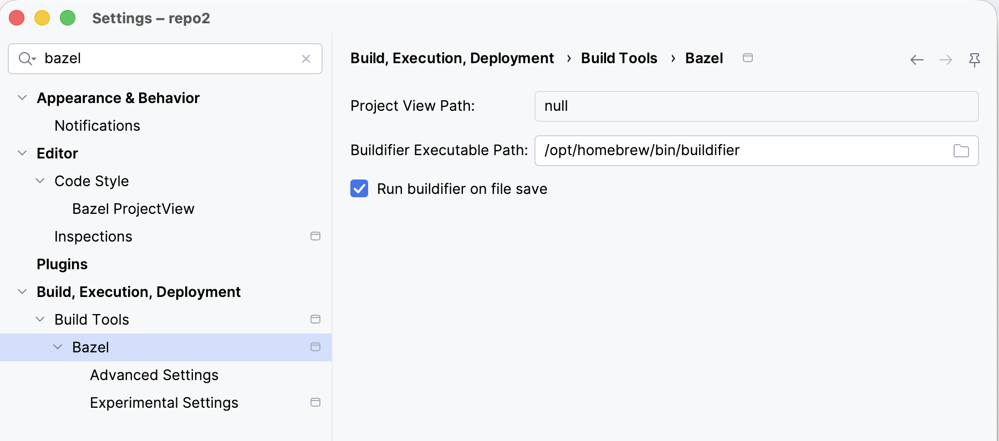

# reprobazelproject

A minimal, reproducible example demonstrating a problem with the JetBrains
Bazel plugin for IntelliJ (the BSP-based plugin, `plugins.jetbrains.com/plugin/22977-bazel`)
and its `.bazelproject` "project view" files, specifically the
`derive_targets_from_directories` feature.

## Layout

```
reprobazelproject/
├── server.bazelproject     # project view file, sits ABOVE the Bazel workspace root
└── server/                 # the actual Bazel workspace root (MODULE.bazel lives here)
    ├── MODULE.bazel
    ├── BUILD.bazel
    └── src/main/java/com/example/App.java
```

This mirrors a common monorepo layout: a git repository root that contains
several projects, one of which (`server/`) is a self-contained Bazel
workspace nested a level below the repository root.

`server.bazelproject` is a valid project view file:

```
directories:
  server

derive_targets_from_directories: true
```

`derive_targets_from_directories: true` is documented to automatically derive
relevant build targets from the `directories` list during sync, without
needing an explicit `targets:` section
(see https://ij.bazel.build/docs/project-views.html#derive_targets_from_directories
and https://www.jetbrains.com/help/idea/bazel-project-view.html).

## The problem

The Bazel workspace root is `server/` (that's where `MODULE.bazel` lives),
**not** the repository root. Bazel itself confirms this:

```console
$ bazel build //:server_bin      # from inside server/ -> works
$ bazel build //server:server_bin # from the repo root -> fails:
  ERROR: The 'build' command is only supported from within a workspace
  (below a directory having a MODULE.bazel file).
```

However, the JetBrains Bazel plugin only recognizes and syncs a Bazel project
when IntelliJ is opened directly at the Bazel workspace root. Per the
official docs: "Opening a Bazel project directory will create a default
project view file" - meaning the workspace root directory itself is what
must be opened.

Opening IntelliJ at the *repository root* (`reprobazelproject/`, where
`server.bazelproject` lives) does **not** produce a Bazel-synced project at
all, because there is no `MODULE.bazel`/`WORKSPACE` at that level. The
`server.bazelproject` file sitting at the repository root is silently
inert - there is no Bazel workspace there for it to apply to, so no sync or
build is ever triggered from it.

To get a working sync, you must instead open IntelliJ directly at
`reprobazelproject/server` (the real workspace root) and load a project view
from there. This defeats the purpose of the project-view feature for
monorepos where the Bazel workspace is nested below the directory you'd
naturally open in the IDE (e.g. the git repository root), and where you may
have several independent Bazel workspaces and other (non-Bazel) projects
side by side in the same repository.

## Evidence: Project View Path shows `null`

Opening **Settings → Build, Execution, Deployment → Build Tools → Bazel**
while the repository root is open confirms the plugin never associated
`server.bazelproject` with the project at all. The **Project View Path**
field literally reads `null`, rather than pointing at
`server.bazelproject` (or any project view file):



This is consistent with the plugin never having discovered a Bazel
workspace to sync in the first place, since no `MODULE.bazel`/`WORKSPACE`
exists at the repository root.

## Steps to reproduce

1. Clone this repository.
2. Open IntelliJ IDEA (with the Bazel plugin installed) at the repository
   root: `idea /path/to/reprobazelproject`.
3. Observe that no Bazel sync/build is triggered, despite the presence of
   `server.bazelproject` at the root with `derive_targets_from_directories: true`
   pointing at the `server` directory.
4. For comparison, open IntelliJ directly at `reprobazelproject/server`
   instead - this correctly initializes as a Bazel workspace.

## Expected behavior

The Bazel plugin should either:

- support a project view file at a directory *above* the Bazel workspace
  root, resolving `directories`/target derivation relative to the nested
  workspace it points to, or
- surface a clear error/warning when a `.bazelproject` file is found outside
  any recognized Bazel workspace, instead of silently doing nothing.
